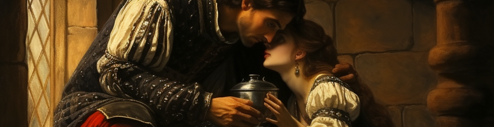

# Statistics in toxicology I & II
This repository is mainly serving to have decenteralized storage for exericises and manipulated data-sets. It can also be used to colaborate on certain exercises and share solutions without using peer to peer file sharing. If you find any mistakes feel free to correct them and push the changes.
